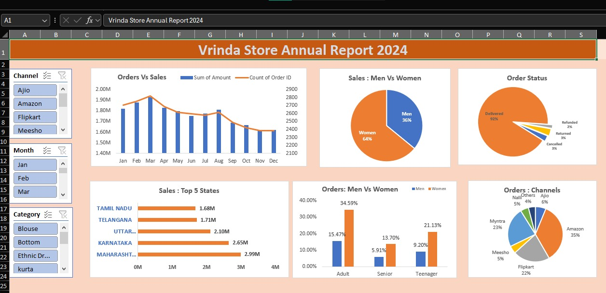

# **Excel Retail Sales Dashboard (Vrinda Store Data Analysis)**  
Interactive Sales & Customer Insights Dashboard using Microsoft Excel

---

## **1. Project Objective**
Analyze Vrinda Store’s **2024 sales performance** to identify customer behavior patterns, top-performing regions, and effective sales channels.  
Insights from this dashboard will assist the business owner in designing **targeted strategies to increase revenue in 2025**.

---

## **2. Dataset**
- **OneDrive Source:**  
  https://1drv.ms/x/s!AogpGWxjxRAZhyDsrNj3bKwvLDEV?e=dFjbcX

- **GitHub Dataset:**  
  https://github.com/jyotigupta17998/Excel-Retail-Sales-Dashboard/blob/main/dashboard/Vrinda%20Store%20Data%20Analysis.xlsx

**Dataset Size:** 25,000+ rows  
**Key Fields:** Order Date, Status, Sales Amount, Gender, Age Group, State, Channel, Category

---

## **3. Key Business Questions (KPIs)**

This dashboard answers:

- Monthly trend of **Sales vs Orders**
- Which **month** generated the highest revenue
- Purchase behavior by **Gender (Men vs Women)**
- Contribution of different **Age Groups**
- Breakdown of **Order Status**
- **Top 10 states** contributing to sales
- Relationship between **Age × Gender**
- Contribution of **Sales Channels** (Amazon, Flipkart, Myntra, etc.)
- Best-selling **Product Categories**
- **% Orders Delivered** successfully

---

## **4. Process & Methodology**

### **Data Cleaning**
- Cleaned and transformed raw data using **Power Query**
- Applied Excel functions: **XLOOKUP, COUNTIFS, IF, TEXT**
- Standardized inconsistent values and corrected formats
- Checked for missing data and removed duplicates

### **Analysis**
- Built KPIs using **Pivot Tables**
- Visualized trends with **Pivot Charts**
- Used **Slicers** and **Timeline Filters** for dynamic interaction

### **Dashboard Development**
- Combined visual elements into a unified interactive dashboard
- Added KPIs for **Total Sales**, **Order Count**, and **Delivery Rate**
- Linked slicers across all charts for seamless filtering

---

## **5. Dashboard Preview**

---

## **6. Key Insights**

- Women contribute **~65%** of total purchases  
- Adults aged **30–49** generate nearly **50%** of all orders  
- **Maharashtra, Karnataka, Uttar Pradesh** are top-performing states  
- **Amazon, Flipkart, Myntra** are the most effective sales channels  
- Over **90%** of orders were successfully delivered  

---

## **7. Recommendations**

To increase sales in 2025:

- Run targeted campaigns for **women aged 30–49**
- Focus marketing efforts in **Maharashtra, Karnataka, Uttar Pradesh**
- Strengthen promotions on **Amazon, Flipkart, Myntra**
- Promote best-selling categories via bundled and seasonal offers

---

## **8. Tools Used**
- Microsoft Excel  
- Power Query  
- Pivot Tables & Pivot Charts  
- Slicers & Timeline  
- Advanced Excel Formulas  

---

## **9. Project Structure**
